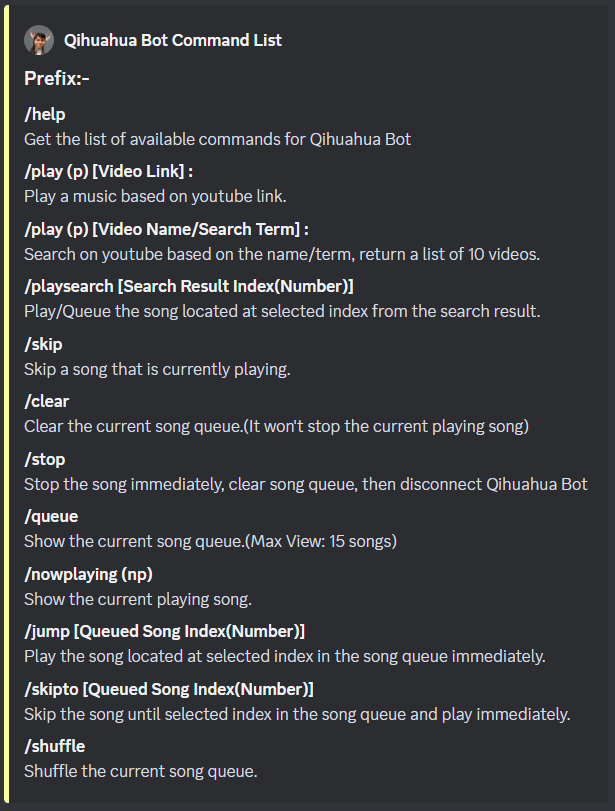

<h1>Qihuahua Bot</h1>

<h4>Welcome to Qihuahua Bot, your friendly Discord companion powered by Discord.js. This versatile bot brings both fun and utility to your server.  </h4>
Whether you want to enjoy some music, stay updated on your favorite streamers, or keep tabs on YouTube uploads, Qihuahua Bot has got you covered.

<h2>Features</h2>

- Play music from YouTube
- Search and queue songs
- Skip, shuffle, and manage the queue
- Get notified when your favorite streamers go live on Twitch: [zhen1011](https://www.twitch.tv/zhen1011) (Default)
- Get notified when new videos are uploaded to a YouTube channel: [BANANA BUS](https://www.youtube.com/@BananaBus0313) (Default)
- Play some mini game with it! (Upcoming)

<h2>Command List</h2>

<h2>Upcoming Features</h2>

- Rock Paper Scissors Mini Game
- PVP Fighting Mini Game
- Multiplayer Dungeon Boss Fighting Game

<h2>Invite Link</h2>

- <h3>~~Not Yet To Be Released~~</h3> <h5>Less likely to be release in the future.</h5>