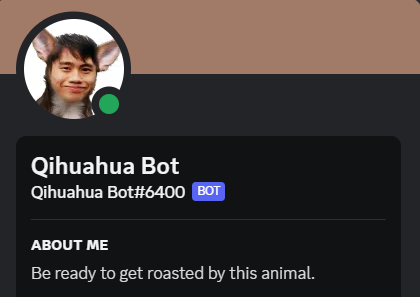
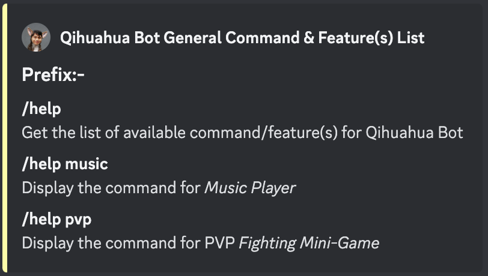
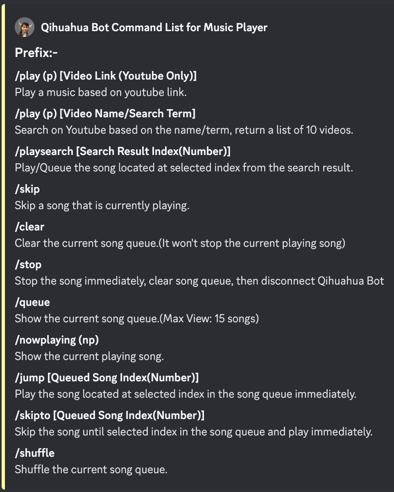
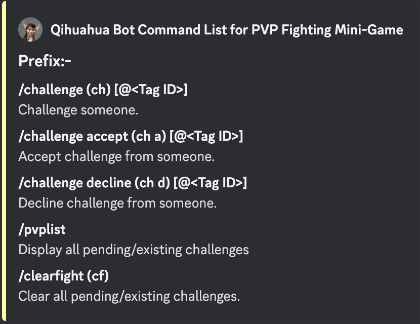
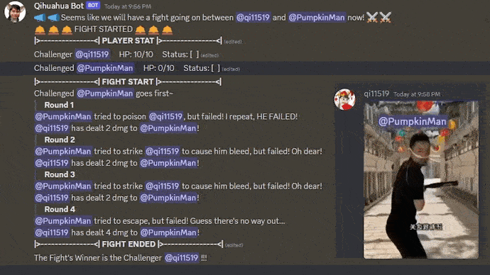

<h1>Qihuahua Bot</h1>

<h4>Welcome to Qihuahua Bot, your friendly Discord companion powered by Discord.js. This versatile bot brings both fun and utility to your server.  </h4>
Whether you want to enjoy some music, stay updated on your favorite streamers, or keep tabs on YouTube uploads, or fight with your friends! (If there's any) Qihuahua Bot has got you covered.

 

<h2>Features</h2>

<i><h3>Music Player</h3></i>
- Play music from YouTube. Sit and chill inside Discord with friends~
- Search and queue songs, not a big deal!
- Skip, shuffle, and manage the queue, easy-peasy.
- Loop music and through playlist <b>(Upcoming Features)</b>
- Get notified when your favorite streamers go live on Twitch: [zhen1011](https://www.twitch.tv/zhen1011) (Default)
- Get notified when new videos are uploaded to a YouTube channel: [BANANA BUS](https://www.youtube.com/@BananaBus0313) (Default)

<i><h3>PVP Fighting Mini-Game</h3></i>
- Challenge your friend to a duel! (Even if you don't have one...Challenge yourself!)
- Completely random and automated fight, maybe it's all about luck~
- Enjoy those funny & hilarious description of prompted action/move!
- Special status action such as <i>'Poison'</i>, <i>'Barrier'</i> and more, making the fight more intense!

<h2>Aren't Qihuahua Bot Fun?</h2>
<h4>You will never find the better one!</h4>

<h2>Upcoming Features</h2>

- Rock Paper Scissors Mini Game
- Multiplayer Dungeon Boss Fighting Game

<h2>Invite Link</h2>
<s><h4>Not Yet To Be Released</h4></s> <h6>Less likely to be release in the future.</h6>
